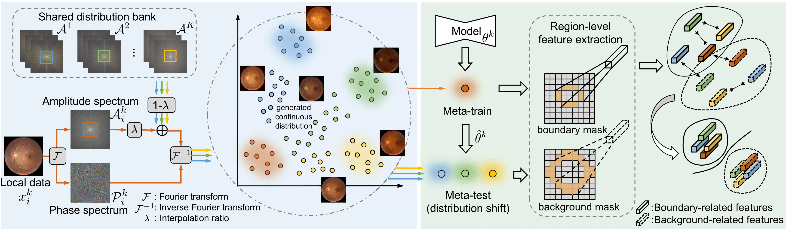
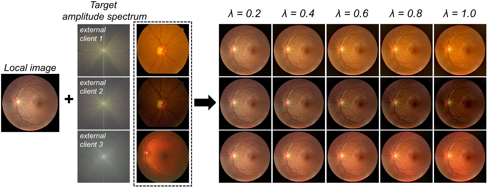

# FedDG: Federated Domain Generalization on Medical Image Segmentation via Episodic Learning in Continuous Frequency Space
by [Quande Liu](https://github.com/liuquande), [Cheng Chen](https://cchen-cc.github.io/), [Jing Qin](https://sn.polyu.edu.hk/en/people/academic_staff/index.html#harry.qin), [Qi Dou](http://www.cse.cuhk.edu.hk/~qdou/), [Pheng-Ann Heng](http://www.cse.cuhk.edu.hk/~pheng/). 

### Introduction

This repository is for our CVPR 2021 paper '[FedDG: Federated Domain Generalization on Medical Image Segmentation via Episodic Learning in Continuous Frequency Space](https://arxiv.org/pdf/2103.06030.pdf)'. 



### Usage

1. Start with a demo for continuous frequency space interpolation among federated clicnets:
   ```shell
   python freq_space_interpolation_demo.py
   ```
<p align="center">
   
</p>

2. Prepare the dataset, and then extract the amplitude spectrum of samples in each local client with the function in ``dataset/prepare_dataset.py``:

3. Organize the data (save the data as npy to speed up federated training) and amplitude spectrum of local clients as following structure:
   ``` 
     ├── dataset
        ├── client1
           ├── data_npy
               ├── sample1.npy, sample2.npy, xxxx
           ├── freq_amp_npy
               ├── amp_sample1.npy, amp_sample2.npy, xxxx
        ├── clientxxx
        ├── clientxxx
   ```
4. Train the federated learning model with ELCFS:
   ```shell
   python train_ELCFS.py
   ```

### Spectral-content adapter routing

This fork adds an optional lightweight adapter route for the original ELCFS
entry points. During local training, each source client keeps a residual
adapter outside FedAvg aggregation. After every round, the checkpoint stores
source-client adapter states plus a dual memory graph:

- spectral/style memory from low-frequency amplitude statistics;
- content memory from global-model decoder prototypes.

The default `train_ELCFS.py` flags enable this path:

```shell
python train_ELCFS.py \
  --use_adapter 1 \
  --memory_routing 1 \
  --memory_style_weight 0.5 \
  --content_memory_update_interval 5 \
  --content_memory_ema_momentum 0.9 \
  --graph_neighbors 1 \
  --seed_topk 2 \
  --expert_topk 2
```

Disable the new route and keep a plain state-dict checkpoint with:

```shell
python train_ELCFS.py --use_adapter 0 --memory_routing 0
```

`test_ELCFS.py` automatically uses the stored dual-memory route when the
checkpoint contains `memory` and `client_adapter_states`; older checkpoints are
loaded as ordinary global models.

### TreeFedDG reproduction

This fork also contains a Fundus reproduction of **TreeFedDG: Alleviating
Global Drift in Federated Domain Generalization for Medical Image
Segmentation**. The original ELCFS entry points remain unchanged.

Use Python 3.9, PyTorch 2.4 and torchvision 0.19 (the versions reported in the
TreeFedDG paper), then install the additional runtime dependencies:

```shell
pip install -r requirements_treefeddg.txt
```

Train one leave-one-domain-out fold:

```shell
python train_treefeddg.py \
  --data_root dataset \
  --unseen_site 0 \
  --experiment fundus
```

The defaults use 100 communication rounds, 50 local epochs, batch size 8,
learning rate `1e-4`, `tau0=0.85`, `epsilon0=0.8`, `omega=0.5`, and FedStyle
probability 0.5. Tree clustering similarity is computed on the configurable
variable layers by default (`--tree_similarity_layers variable`), because
full-model cosine can be dominated by shared/fixed layers and collapse all
source clients into a one-level tree. To reproduce the previous full-parameter
behavior exactly, pass `--tree_similarity_layers all`.

For fast reproduction diagnostics, training evaluates the current tree on the
unseen target domain after every communication round by default
(`--eval_every 1`). This intentionally follows the original ELCFS-style
"test-during-training" workflow and is not a strict validation protocol.
The script writes `round_eval_history.jsonl`, tracks the best average Dice in
`best_summary.json`, and saves the corresponding checkpoint to
`checkpoints/best.pth`. Disable this behavior with `--eval_every 0`.

A quick pipeline smoke run is available with:

```shell
python train_treefeddg.py \
  --data_root dataset \
  --unseen_site 0 \
  --rounds 1 \
  --local_epochs 1 \
  --max_batches_per_epoch 1 \
  --save_every 1 \
  --experiment smoke
```

Run feature-guided model-chain inference with the final checkpoint:

```shell
python test_treefeddg.py \
  --data_root dataset \
  --checkpoint output/treefeddg/fundus_unseen0/checkpoints/last.pth
```

Inference defaults to soft probability ensembling (`--ensemble_mode soft`),
which lets every model in the selected chain affect the final prediction. The
previous hard weighted vote is still available with `--ensemble_mode hard_vote`;
however, with a two-node chain and the paper's hierarchy weight, hard voting can
degenerate to the leaf model because the leaf weight alone exceeds 0.5.

The first inference run may download the official ImageNet ResNet-18 weights.
For an offline plumbing test only, pass `--feature_weights none`; this is not a
paper-faithful evaluation.

The paper does not specify the clustering implementation, threshold adjustment
coefficient, FedStyle insertion blocks, fixed/variable layer boundary, or
feature histogram bins. These choices are exposed as command-line arguments.
The defaults use threshold-graph connected components, `threshold_step=0.05`,
FedStyle after the first three encoder blocks, the first two encoder blocks as
fixed layers, and 16 histogram bins. The progressive fusion exponent follows
the paper's prose (fusion decreases toward leaves), correcting the inconsistent
printed exponent in Eq. (10).

#### Six-site Prostate NIfTI pipeline

The raw prostate data under `dataset2` is discovered case-insensitively, so both
`_segmentation.nii.gz` and BMC's `_Segmentation.nii.gz` names are supported.
Preprocess all 116 volumes into mmap-friendly axial arrays:

```shell
python prepare_prostate_nifti.py \
  --input_root dataset2 \
  --output_root dataset2_processed
```

The default pipeline reorients images to LPS, aligns labels to the image grid,
keeps native voxel spacing, center-crops/pads each slice to `384x384`, applies
volume-wise robust z-score normalization, and maps every non-zero source label
to the whole-prostate foreground. To resample in-plane resolution explicitly,
for example, add `--target_spacing 0.5 0.5 0` (zero preserves native z spacing).

Site indices are `0=BIDMC`, `1=BMC`, `2=HK`, `3=I2CVB`, `4=RUNMC`, and `5=UCL`.
Train a leave-one-site-out prostate fold with:

```shell
python train_treefeddg.py \
  --dataset prostate \
  --prostate_manifest dataset2_processed/manifest.json \
  --unseen_site 0 \
  --experiment prostate
```

Inference uses every axial slice of the unseen volumes and reports case-level
3D Dice and spacing-aware HD95:

```shell
python test_treefeddg.py \
  --checkpoint output/treefeddg/prostate_unseenBIDMC/checkpoints/last.pth \
  --prostate_manifest dataset2_processed/manifest.json
```
   
### Citation
If this repository is useful for your research, please consider citing:
```
@article{liu2021feddg,
  title={FedDG: Federated Domain Generalization on Medical Image Segmentation via Episodic Learning in Continuous Frequency Space},
  author={Liu, Quande and Chen, Cheng and Qin, Jing and Dou, Qi and Heng, Pheng-Ann},
  journal={The IEEE/CVF Conference on Computer Vision and Pattern Recognition (CVPR)},
  year={2021}
}
```

#### Acknowledgement
Some of the code is adapted from [SAML](https://github.com/liuquande/SAML) and [FDA](https://github.com/YanchaoYang/FDA). The datasets used in this paper are downloaded from [Prostate](https://liuquande.github.io/SAML/) and [Fundus](https://github.com/EmmaW8/Dofe).

### Questions

Please contact 'qdliu0226@gmail.com'
